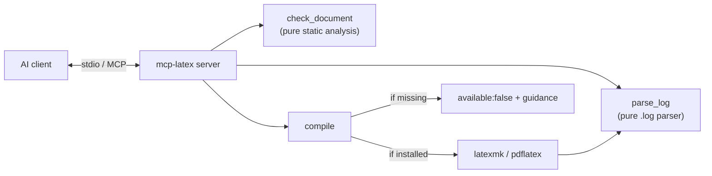

# Architecture

mcp-latex exposes three tools over stdio. The analysis tools are pure and need no TeX; `compile`
shells out to a TeX engine when one is available and degrades gracefully when it isn't.

## Module map

| Module | Responsibility |
| --- | --- |
| `index.ts` | MCP server; registers tools with zod schemas |
| `lib/document.ts` | Labels/refs/citations, undefined refs, unbalanced envs (pure) |
| `lib/log.ts` | Parse `.log` into errors/warnings/box counts (pure) |
| `lib/compile.ts` | Shell out to latexmk/pdflatex; never throws for a missing engine |

## Design principles

- **Works without TeX** — `check_document` and `parse_log` are pure, so the most useful tools
  need no install.
- **Graceful degradation** — `compile` returns `available:false` instead of throwing when no
  engine is present.
- **Assistant-driven fixes** — the server reports structured findings; the assistant edits.
- **Tested** — unit tests for the parsers, plus a stdio integration test.
