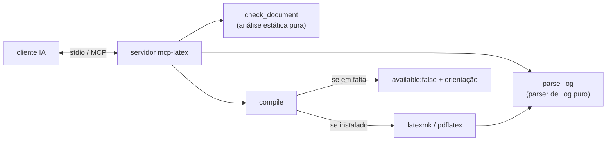

# Arquitetura

O mcp-latex expõe três ferramentas por stdio. As de análise são puras e não precisam de TeX; o
`compile` faz shell-out para um engine TeX quando existe e degrada com elegância quando não.

## Mapa de módulos

| Módulo | Responsabilidade |
| --- | --- |
| `index.ts` | Servidor MCP; regista as tools com schemas zod |
| `lib/document.ts` | Labels/refs/citações, refs indefinidas, ambientes desequilibrados (puro) |
| `lib/log.ts` | Parsear `.log` em erros/avisos/contagens de boxes (puro) |
| `lib/compile.ts` | Shell-out para latexmk/pdflatex; nunca lança por falta de engine |

## Princípios de design

- **Funciona sem TeX** — `check_document` e `parse_log` são puros, por isso as ferramentas mais
  úteis não precisam de instalação.
- **Degradação graciosa** — o `compile` devolve `available:false` em vez de lançar quando não há engine.
- **Correções conduzidas pelo assistente** — o servidor reporta resultados estruturados; o assistente edita.
- **Testado** — testes unitários dos parsers, mais um teste de integração stdio.
